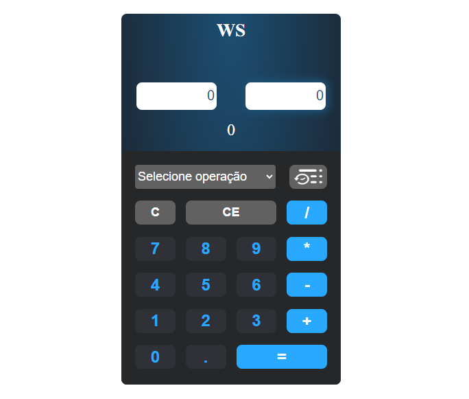

# Calculadora-Vuejs

Esta atividade é referente ao módulo 27 VueJS do curso Full Stack Python da EBAC. A atividade consistia em criar uma calculadora simples utilizando o VueJS, que tivesse dois campos numéricos e um input do tipo select para escolher entre as operações. Ao alterar os campos, a operação é realizada automáticamente.

A calculadora desenvolvida possui:

Operações Botões e teclado:
- Adição,
- Subtração,
- Multiplicação
- Divisão

Recursos:
- Select de Operações
- Apagar caracteres
- Limpar Campos
- Histórico de cálculos
- Validação númerica
- Formatação de decimais
- Formatação de números negativos

Confira o projeto: https://wsilva-calculadora-vuejs.vercel.app/




This template should help get you started developing with Vue 3 in Vite.

## Recommended IDE Setup

[VSCode](https://code.visualstudio.com/) + [Volar](https://marketplace.visualstudio.com/items?itemName=Vue.volar) (and disable Vetur) + [TypeScript Vue Plugin (Volar)](https://marketplace.visualstudio.com/items?itemName=Vue.vscode-typescript-vue-plugin).

## Customize configuration

See [Vite Configuration Reference](https://vitejs.dev/config/).

## Project Setup

```sh
npm install
```

### Compile and Hot-Reload for Development

```sh
npm run dev
```

### Compile and Minify for Production

```sh
npm run build
```
